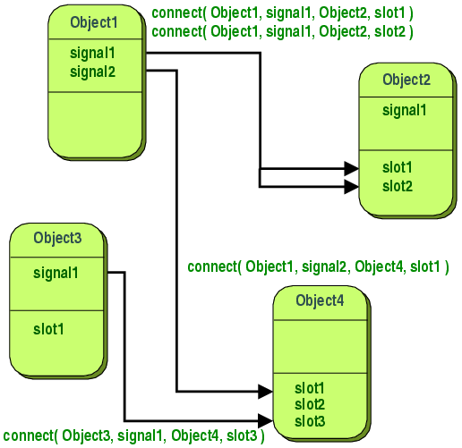

Signal与Slot的使用
========================
Signals and slots are used for communication between objects. The signals and slots mechanism is a central feature of Qt and probably the part that differs most from the features provided by other frameworks. Signals and slots are made possible by Qt's meta-object system.

信号和槽是一种对象间的通信机制，这也是Qt不同于其他框架的核心区别，它的实现得益于Qt的元对象系统。

####1.背景
In GUI programming, when we change one widget, we often want another widget to be notified. More generally, we want objects of any kind to be able to communicate with one another. For example, if a user clicks a Close button, we probably want the window's close() function to be called.

在GUI编程中，当一个控件发送变化时，另外的控件需要得到通知。更为广泛的来讲，我们期望一个对象可以与另外一个对象可以很方便的进行通信。譬如，一个用户点击了一个关闭按钮，用户可能期望窗口的close函数被调用。

Other toolkits achieve this kind of communication using callbacks. A callback is a pointer to a function, so if you want a processing function to notify you about some event you pass a pointer to another function (the callback) to the processing function. The processing function then calls the callback when appropriate. While successful frameworks using this method do exist, callbacks can be unintuitive and may suffer from problems in ensuring the type-correctness of callback arguments

一般而已，大部分的框架使用callback机制来实现对象间的通信。一个callback其实就是一个函数指针，如果你期望一个正在运行通知你一些事件，你可以传递一个callback函数指针到这个函数，这个callback函数将在适当的时候被调用。虽然某些框架成功了使用了callback机制，而且很直观；但缺点在于需要确保回调参数的类型正确性。

####2.信号和槽简介
In Qt, we have an alternative to the callback technique: We use signals and slots. A signal is emitted when a particular event occurs. Qt's widgets have many predefined signals, but we can always subclass widgets to add our own signals to them. A slot is a function that is called in response to a particular signal. Qt's widgets have many pre-defined slots, but it is common practice to subclass widgets and add your own slots so that you can handle the signals that you are interested in.

在Qt中，callback机制的替代解决方案就是信号和槽。当一个特定的事件发生时，可以发射一个信号，Qt的widgets预定义了很多信号，同样我们可以继承这些widgets对象，添加我们自定义的信号；槽本质上是一个函数，当一个特定的信号发射时，连接这个信号的槽将会被调用，同样Qt的widgets预定义了很多槽，实际使用中更多的是继承widgets，定义自己的槽函数，这样我们就可以处理感兴趣的信号。

The signals and slots mechanism is type safe: The signature of a signal must match the signature of the receiving slot. (In fact a slot may have a shorter signature than the signal it receives because it can ignore extra arguments.) Since the signatures are compatible, the compiler can help us detect type mismatches when using the function pointer-based syntax. The string-based SIGNAL and SLOT syntax will detect type mismatches at runtime. Signals and slots are loosely coupled: A class which emits a signal neither knows nor cares which slots receive the signal. Qt's signals and slots mechanism ensures that if you connect a signal to a slot, the slot will be called with the signal's parameters at the right time. Signals and slots can take any number of arguments of any type. They are completely type safe.

Qt的 signals and slots信号和槽机制是类型安全的。通常，信号的签名必须匹配槽的签名（实际上，槽函数的签名个数可以少于信号的签名个数因为槽会忽略多余的签名）。因为签名是兼容的，编译器会帮助我们动态匹配信号和槽。基于字符串的信号和槽语法将在运行时动态匹配。 信号和槽是松散耦合的；一个对象发射了一个信号，它不关心是否有槽需要接受这个信号；Qt的信号和槽机制确保了如果一个信号和一个槽连接上了，槽将接受信号的签名参数值在适当的时间执行。信号和槽可以接受任意数量任意类型的参数，是完全类型安全的。

All classes that inherit from QObject or one of its subclasses (e.g., QWidget) can contain signals and slots. Signals are emitted by objects when they change their state in a way that may be interesting to other objects. This is all the object does to communicate. It does not know or care whether anything is receiving the signals it emits. This is true information encapsulation, and ensures that the object can be used as a software component.
所有继承自QObject的类或者是继承自QObject子类（譬如QWidget）都可以使用信号和槽。对象的状态发生改变的时候就可以发射其他对象感兴趣的信号，这样所有的对象就可以相互通信，无需关心是否有对象正在接受这个信号。这是真正的信息封装, 确保对象可以用作一个软件组件。

Slots can be used for receiving signals, but they are also normal member functions. Just as an object does not know if anything receives its signals, a slot does not know if it has any signals connected to it. This ensures that truly independent components can be created with Qt.

槽可以用来接收信号，但是同样槽函数也是普通的成员函数。就像一个对象不知道是否需要接收任何信号,一个槽并不知道是否有信号连接到它。这样确保了Qt具备创建独立的组件的能力。

You can connect as many signals as you want to a single slot, and a signal can be connected to as many slots as you need. It is even possible to connect a signal directly to another signal. (This will emit the second signal immediately whenever the first is emitted.)

你可以按需求连接多个信号到一个槽，同样也可以连接一个信号到多个槽，甚至以可以直接连接一个信号到另外一个信号（第一个信号发射的同时第二个信号也会被发射）。

Together, signals and slots make up a powerful component programming mechanism.

因此，信号和槽构建了一套强大的组件编程机制。

####3.信号

Signals are emitted by an object when its internal state has changed in some way that might be interesting to the object's client or owner. Signals are public access functions and can be emitted from anywhere, but we recommend to only emit them from the class that defines the signal and its subclasses.

信号在对象状态改变，并且这个改变期望被其他对象收到的时候发出。信号本质上是公有可访问的函数，可以在任意地方发射。但是强烈建议信号只在定义信号的类或子类中发射。

When a signal is emitted, the slots connected to it are usually executed immediately, just like a normal function call. When this happens, the signals and slots mechanism is totally independent of any GUI event loop. Execution of the code following the emit statement will occur once all slots have returned. The situation is slightly different when using queued connections; in such a case, the code following the emit keyword will continue immediately, and the slots will be executed later.

当一个信号发射时，被连接的槽函数通常会立即执行，就好比一个普通的函数调用。这样一来信号与槽机制是完全独立于任何GUI事件循环。执行上下文将在信号发射后，所有与之连接的槽函数全部执行完毕后返回。这种情况和使用**`队列连接`**略有不同;在这种情况下,信号发射后代码执行上下文即可返回， 与之连接的槽函数将稍后执行。

If several slots are connected to one signal, the slots will be executed one after the other, in the order they have been connected, when the signal is emitted.

如果多个槽连接了同一个信号，信号发射时槽函数将会按照连接顺序一个一个执行。

Signals are automatically generated by the moc and must not be implemented in the .cpp file. They can never have return types (i.e. use void).

信号的实现代码是由moc工具自动生成的，不需要用户在cpp文件中实现。信号的返回类型永远是void。

A note about arguments: Our experience shows that signals and slots are more reusable if they do not use special types. If QScrollBar::valueChanged() were to use a special type such as the hypothetical QScrollBar::Range, it could only be connected to slots designed specifically for QScrollBar. Connecting different input widgets together would be impossible.

信号参数注明：经验表面，如果不使用特殊的类型，信号和槽是可复用的。如果信号定义的时候使用了特殊的数据类型，那么这个信号将只能在使用这个特殊类型的类中使用，失去了通用性，通常定义信号和槽时尽量使用通用的数据类型。

####4. 槽
A slot is called when a signal connected to it is emitted. Slots are normal C++ functions and can be called normally; their only special feature is that signals can be connected to them.

当信号发射时，与之连接的槽函数就被调用。槽函数和普通的c++函数一样,可以被正常调用。它们唯一的区别就是槽函数可以被信号连接，普通的函数不能。

Since slots are normal member functions, they follow the normal C++ rules when called directly. However, as slots, they can be invoked by any component, regardless of its access level, via a signal-slot connection. This means that a signal emitted from an instance of an arbitrary class can cause a private slot to be invoked in an instance of an unrelated class.
既然槽函数是普通的成员函数，必然遵循普通的c++函数调用规则，可以被直接调用。然而，作为一个槽函数，它们可以被任何组件通过信号和槽连接调用，无论访问权限如何。
这就意味着任何一个类实例发射了一个信号，可以引起一个不相关类实例的私有槽被执行。

You can also define slots to be virtual, which we have found quite useful in practice.

同样，你可以定义槽函数为虚函数，实践证明相当有用。

Compared to callbacks, signals and slots are slightly slower because of the increased flexibility they provide, although the difference for real applications is insignificant. In general, emitting a signal that is connected to some slots, is approximately ten times slower than calling the receivers directly, with non-virtual function calls. This is the overhead required to locate the connection object, to safely iterate over all connections (i.e. checking that subsequent receivers have not been destroyed during the emission), and to marshall any parameters in a generic fashion. While ten non-virtual function calls may sound like a lot, it's much less overhead than any new or delete operation, for example. As soon as you perform a string, vector or list operation that behind the scene requires new or delete, the signals and slots overhead is only responsible for a very small proportion of the complete function call costs. The same is true whenever you do a system call in a slot; or indirectly call more than ten functions. The simplicity and flexibility of the signals and slots mechanism is well worth the overhead, which your users won't even notice.

和回调机制相比，因为它的灵活调用方式，信号和槽的执行效率略慢，然而，实际应用程序中这点性能损失微不足道。一般而言，相比非虚函数直接调用而言，发射信号来调用一个槽函数比直接调用慢10倍左右。这种性能开销是由于信号和槽机制要安全的定位连接的对象，需要遍历所有的连接（并检测连接对象是否被删除了），并匹配对应参数。实际上，10个非虚函数调用的性能开销远小于一个对象的创建和销毁。譬如，处理字符串时，容器和列表操作涉及大量的创建和销毁动作，信号和槽引入的性能开仅仅只占整个函数调用非常小的一部分。这个和一个槽函数中执行一个系统调用或间接调用10个普通函数产生的性能开销是一样的。相比信号与槽机制的简单性和灵活性而言，这点性能开销, 微不足道。

Note that other libraries that define variables called signals or slots may cause compiler warnings and errors when compiled alongside a Qt-based application. To solve this problem, #undef the offending preprocessor symbol.

注意：如果其他库定义变量使用了 signals or slots关键字，将导致基于Qt的应用程序编译报错，如果需要解决这个问题，可以使用#undef销毁offending preprocessor symbol预处理器。

####5.举例
A minimal C++ class declaration might read:

	class Counter
	{
	public:
	    Counter() { m_value = 0; }
	
	    int value() const { return m_value; }
	    void setValue(int value);
	
	private:
	    int m_value;
	};
A small QObject-based class might read:

	#include <QObject>
	
	class Counter : public QObject
	{
	    Q_OBJECT
	
	public:
	    Counter() { m_value = 0; }
	
	    int value() const { return m_value; }
	
	public slots:
	    void setValue(int value);
	
	signals:
	    void valueChanged(int newValue);
	
	private:
	    int m_value;
	};
The QObject-based version has the same internal state, and provides public methods to access the state, but in addition it has support for component programming using signals and slots. This class can tell the outside world that its state has changed by emitting a signal, valueChanged(), and it has a slot which other objects can send signals to.

All classes that contain signals or slots must mention Q_OBJECT at the top of their declaration. They must also derive (directly or indirectly) from QObject.

Slots are implemented by the application programmer. Here is a possible implementation of the Counter::setValue() slot:

	void Counter::setValue(int value)
	{
	    if (value != m_value) {
	        m_value = value;
	        emit valueChanged(value);
	    }
	}
The emit line emits the signal valueChanged() from the object, with the new value as argument.

In the following code snippet, we create two Counter objects and connect the first object's valueChanged() signal to the second object's setValue() slot using QObject::connect():

    Counter a, b;
    QObject::connect(&a, &Counter::valueChanged,
                     &b, &Counter::setValue);

    a.setValue(12);     // a.value() == 12, b.value() == 12
    b.setValue(48);     // a.value() == 12, b.value() == 48
Calling a.setValue(12) makes a emit a valueChanged(12) signal, which b will receive in its setValue() slot, i.e. b.setValue(12) is called. Then b emits the same valueChanged() signal, but since no slot has been connected to b's valueChanged() signal, the signal is ignored.

Note that the setValue() function sets the value and emits the signal only if value != m_value. This prevents infinite looping in the case of cyclic connections (e.g., if b.valueChanged() were connected to a.setValue()).

By default, for every connection you make, a signal is emitted; two signals are emitted for duplicate connections. You can break all of these connections with a single disconnect() call. If you pass the Qt::UniqueConnection type, the connection will only be made if it is not a duplicate. If there is already a duplicate (exact same signal to the exact same slot on the same objects), the connection will fail and connect will return false

This example illustrates that objects can work together without needing to know any information about each other. To enable this, the objects only need to be connected together, and this can be achieved with some simple QObject::connect() function calls, or with uic's {automatic connections} feature.

####6.信号和槽的高级用法

For cases where you may require information on the sender of the signal, Qt provides the QObject::sender() function, which returns a pointer to the object that sent the signal.

很多情况下，需要了解信号的发射者是哪个实例对象，Qt提供了QObject::sender()方法，这个方法将返回一个指向信号发射者的指针。

The QSignalMapper class is provided for situations where many signals are connected to the same slot and the slot needs to handle each signal differently.

QSignalMapper类为这种情况提供了便利：多个信号连接同一个槽，但槽需要对每个信号做不同的处理。

#####举例：
Suppose you have three push buttons that determine which file you will open: "Tax File", "Accounts File", or "Report File".

In order to open the correct file, you use QSignalMapper::setMapping() to map all the QPushButton::clicked() signals to a QSignalMapper object. Then you connect the file's QPushButton::clicked() signal to the QSignalMapper::map() slot.

    signalMapper = new QSignalMapper(this);
    signalMapper->setMapping(taxFileButton, QString("taxfile.txt"));
    signalMapper->setMapping(accountFileButton, QString("accountsfile.txt"));
    signalMapper->setMapping(reportFileButton, QString("reportfile.txt"));

    connect(taxFileButton, &QPushButton::clicked,
        signalMapper, &QSignalMapper::map);
    connect(accountFileButton, &QPushButton::clicked,
        signalMapper, &QSignalMapper::map);
    connect(reportFileButton, &QPushButton::clicked,
        signalMapper, &QSignalMapper::map);
Then, you connect the mapped() signal to readFile() where a different file will be opened, depending on which push button is pressed.

    connect(signalMapper, SIGNAL(mapped(QString)),
        this, SLOT(readFile(QString)));

####7. Qt使用第三方的信号和槽

It is possible to use Qt with a 3rd party signal/slot mechanism. You can even use both mechanisms in the same project. Just add the following line to your qmake project (.pro) file.

	CONFIG += no_keywords

It tells Qt not to define the moc keywords signals, slots, and emit, because these names will be used by a 3rd party library, e.g. Boost. Then to continue using Qt signals and slots with the no_keywords flag, simply replace all uses of the Qt moc keywords in your sources with the corresponding Qt macros Q_SIGNALS (or Q_SIGNAL), Q_SLOTS (or Q_SLOT), and Q_EMIT.