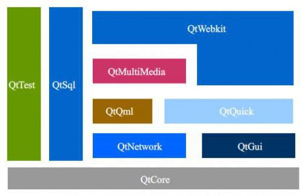
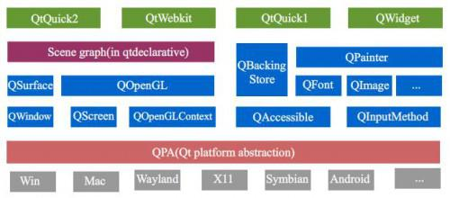

Qt之基础架构及各个模块简介
===========================

Qt模块
=====================
####1. Qt基本模块
Qt essentials define the foundation of Qt on all platforms. They are available on all supported development platforms and on the tested target platforms. They will remain source and binary compatible during Qt 5.

Qt essentials定义了Qt在所有平台上的构成。这些模块在所有支持的平台和目标测试平台上都是有效的。Qt5将保持源码和二进制兼容性。

Essential modules are general and useful for a majority of Qt applications. A module that is used for a special purpose is considered an add-on module even if it is available on all supported platforms.

基本模块一般适用于大多数Qt应用程序。具备特殊用途的模块被认为是一个附加模块, 即便这个模块适用于所有支持的平台。

|Module	|Description|
| :--------|---------------:|
|**Qt Core**	| Core non-graphical classes used by other modules.|
|**Qt GUI**	| Base classes for graphical user interface (GUI) components. Includes OpenGL.|
|**Qt Multimedia**|	Classes for audio, video, radio and camera functionality.|
|**Qt Multimedia Widgets**|	Widget-based classes for implementing multimedia functionality.|
|**Qt Network**|	Classes to make network programming easier and more portable.|
|**Qt QML**	|Classes for QML and JavaScript languages.|
|**Qt Quick**|	A declarative framework for building highly dynamic applications with custom user interfaces.|
|**Qt Quick Controls**|	Reusable Qt Quick based UI controls to create classic desktop-style user interfaces.|
|**Qt Quick Dialogs**|	Types for creating and interacting with system dialogs from a Qt Quick application.|
|**Qt Quick Layouts**|	Layouts are items that are used to arrange Qt Quick 2 based items in the user interface.|
|**Qt SQL**|	Classes for database integration using SQL.|
|**Qt Test**|	Classes for unit testing Qt applications and libraries.|
|**Qt WebKit (Deprecated)**|	Classes for a WebKit2 based implementation and a QML API. Deprecated in favor of Qt WebEngine.|
|**Qt WebKit Widgets (Deprecated)**|	WebKit1 and QWidget-based classes from Qt 4.|
|**Qt Widgets**	|Classes to extend Qt GUI with C++ widgets.|

If you use qmake to build your projects, the Qt Core and Qt GUI modules are included by default. To link only against Qt Core, add the following line to your .pro file:

	QT -= gui
On Windows, if you do not use qmake or other build tools such as CMake, you also need to link against the qtmain library.

####2. Qt 附加模块

Qt Add-On modules bring additional value for specific purposes. These modules may only be available on some development platform. Many add-on modules are either feature-complete and exist for backwards compatibility, or are only applicable to certain platforms. Each add-on module specifies its compatibility promise separately.
Qt的附加模块是特别目的引入的额外功能。这些模块可能在某些开发平台上无效。许多模块要么特性齐备，兼容存在，要么仅仅针对某些特定平台。每个附加模块的兼容性也是独立的。

The Qt installers include the option of downloading the add-ons. For more information, visit the Getting Started with Qt page.
Qt 安装器包含了可下载的附加模块；
The following table lists the Qt add-ons:

|Module	|Development Platforms	|Target Platforms	|Description|
|:-----------:|:------------:|:---------------:|:-----------------:|
|**Active Qt**|	Windows|		|Classes for applications which use ActiveX and COM
|**Enginio**|	All|	All|A Backend-as-a-Service solution to ease the backend development for connected and data-driven applications.|
|**Qt Android Extras**|	All	|Android	|Provides platform-specific APIs for Android.|
|**Qt Bluetooth**|	All|	Android, iOS, Linux and OS X	|Provides access to Bluetooth hardware.|
|**Qt Canvas 3D**|	All		|Enables OpenGL-like 3D drawing calls from Qt Quick applications using JavaScript.|
|**Qt Concurrent**|	|	|	Classes for writing multi-threaded programs without |using low-level threading primitives.
|**Qt D-Bus**|	All|	|	Classes for inter-process communication over the D-Bus protocol.|
|**Qt Graphical Effects**|	All	|	|Graphical effects for use with Qt Quick 2.|
|Qt Image Formats|	All	|	|Plugins for additional image formats: TIFF, MNG, TGA, WBMP.|
|**Qt Mac Extras**|	All	|OS X|	Provides platform-specific APIs for OS X.|
|**Qt NFC**|	All|	Linux|	Provides access to Near-Field communication (NFC) hardware.|
|**Qt OpenGL**|		|	|OpenGL support classes.Note: Provided to ease porting from Qt 4.x. Please use the QOpenGL classes in Qt GUI for new code|
|**Qt Platform Headers**	|		||Provides classes that encapsulate platform-specific information, tied to a given runtime configuration of a platform plugin.|
|**Qt Positioning**|	All|	|Provides access to position, satellite and area monitoring classes.|
|**Qt Print Support**|	All|	|	Classes to make printing easier and more portable.|
|**Qt Declarative (Deprecated)**|	All	||	Qt Declarative is provided for Qt 4 compatibility. The documentation is available through the Qt 4.8 Qt Quick documentation.|
|**Qt Quick Extras**|	All	|	|Provides a specialized set of controls that can be used to build interfaces in Qt Quick.|
|**Qt Quick Widgets**|	All	|	|Provides a C++ widget class for displaying a Qt Quick user interface.|
|**Qt Script (Deprecated)**	|All	||	Classes for making Qt applications scriptable. Provided for Qt 4.x compatibility. Please use the QJS* classes in the Qt QML module for new code.|
|**Qt Script Tools**|	All	||	Additional components for applications that use Qt Script.|
|**Qt Sensors**|	All|	Android, Qt for iOS, WinRT and Mer.	|Provides access to sensor hardware and motion gesture recognition.|
|**Qt Serial Port**|	All	|Windows, Linux, and OS X.	|Provides access to hardware and virtual serial ports.|
|**Qt SVG**	|All	|	Classes for displaying the contents of SVG files. Supports a subset of the SVG 1.2 Tiny standard.|
|**Qt WebChannel**|	All	|All	|Provides access to QObject or QML objects from HTML clients for seamless integration of Qt applications with HTML/JavaScript clients.|
|**Qt WebEngine**|	All	|Windows, Linux, and OS X.	|Provides a QML API to run web applications using the Chromium browser project.|
|**Qt WebEngine Widgets**|	All	|Windows, Linux, and OS X.	|Provides a C++ API to run web applications using the Chromium browser project.|
|**Qt WebSockets**|	All|	All|	Provides WebSocket communication compliant with RFC 6455.|
|**Qt Windows Extras**|	All	|Windows	|Provides platform-specific APIs for Windows.|
|**Qt X11 Extras**|	All	|Linux/X11	|Provides platform-specific APIs for X11.|
|**Qt XML**	|	|	|C++ implementations of SAX and DOM.Note: Deprecated, please use QXmlStreamReader and QXmlStreamWriter for new functionality.|
|**Qt XML Patterns**|		|	|Support for XPath, XQuery, XSLT and XML schema validation.|

####3. QtCore模块
All other Qt modules rely on this module. To include the definitions of the module's classes, use the following directive:
所有Qt的模块都依赖这个模块；如果需要使用这个模块内的所有类，可以使用如下声明：
	
	#include <QtCore>
If you use qmake to build your projects, Qt Core is included by default.

如果使用qmake去构建工程，QtCore默认包含。
#####Core Functionalities

+ **Qt增加如下特性到c++中：**
	+ The Meta-Object System 元对象系统
	+ The Property System  属性系统
	+ Object Model  对象模型
	+ Object Trees & Ownership  对象树和所有权
	+ Signals & Slots 信号和槽
	+ Threading and Concurrent Programming 线程和并发编程

		Qt provides thread support in the form of platform-independent threading classes, a thread-safe way of posting events, and signal-slot connections across threads. Multithreaded programming is also a useful paradigm for performing time-consuming operations without freezing the user interface of an application.
		
		Qt的线程库提供了是平台独立的线程类，可以线程安全的传递事件方式和跨线程的信号和槽。多线程编程同时也是一个有效的方式来执行耗时的操作 ，避免阻塞应用程序的用户界面。

		The Thread Support in Qt page contains information on implementing threads in applications. Additional concurrent classes are provided by the Qt Concurrent module.
		
		QtCore提供了基本的线程支持， Qt Concurrent module模块提供了更多的并发支持

+ **Input/Output, Resources, and Containers**

	Qt provides a resource system for organizing application files and assets, a set of containers, and classes for receiving input and printing output.
	
  + Container Classes  容器类
  +  Serializing Qt Data Types  数据类型序列化
  +  Implicit Sharing 隐式共享

	In addition, Qt Core provides a platform-independent mechanism for storing binary files in the application's executable.

	+ The Qt Resource System Qt资源系统

+ **Additional Frameworks**

	Qt Core also provides some of Qt's key frameworks.

  + The Animation Framework  动画框架
  + JSON Support in Qt    JSON支持
  + The State Machine Framework  状态机框架
  + How to Create Qt Plugins 插件机制
  + The Event System  事件系统

####4. QtGui模块

The Qt GUI module provides classes for windowing system integration, event handling, OpenGL and OpenGL ES integration, 2D graphics, basic imaging, fonts and text. These classes are used internally by Qt's user interface technologies and can also be used directly, for instance to write applications using low-level OpenGL ES graphics APIs.

To include the definitions of the module's classes, use the following directive:

	#include <QtGui>
If you use qmake to build your projects, Qt GUI is included by default. To disable Qt GUI, add the following line to your .pro file:

	QT -= gui

+ **Application Windows**

	The most important classes in the Qt GUI module are QGuiApplication and QWindow. A Qt application that wants to show content on screen, will need to make use of these. QGuiApplication contains the main event loop, where all events from the window system and other sources are processed and dispatched. It also handles the application's initialization and finalization.
	
	The QWindow class represents a window in the underlying windowing system. It provides a number of virtual functions to handle events (QEvent) from the windowing system, such as touch-input, exposure, focus, key strokes and geometry changes.

+ **2D Graphics**

	The Qt GUI module contains classes for 2D graphics, imaging, fonts and advanced typography.
	
	A QWindow created with the surface type QSurface::RasterSurface can be used in combination with QBackingStore and QPainter, Qt's highly optimized 2D vector graphics API. QPainter supports drawing lines, polygons, vector paths, images and text. For more information, see Paint System and Raster Window Example.
	
	Qt can load and save images using the QImage and QPixmap classes. By default, Qt supports the most common image formats including JPEG and PNG among others. Users can add support for additional formats via the QImageIOPlugin class. For more information, see Reading and Writing Image Files
	
	Typography in Qt is done with QTextDocument which uses the QPainter API in combination with Qt's font classes, primarily QFont. Applications that prefer more low-level APIs to text and font handling, classes like QRawFont and QGlyphRun can be used.

+ **OpenGL and OpenGL ES Integration**

	QWindow supports rendering using OpenGL and OpenGL ES, depending on what the platform supports. OpenGL rendering is enabled by setting the QWindow's surface type to QSurface::OpenGLSurface, choosing the format attributes with QSurfaceFormat, and then creating a QOpenGLContext to manage the native OpenGL context. In addition, Qt has QOpenGLPaintDevice, which enables the use of OpenGL accelerated QPainter rendering, as well as convenience classes that simplify the writing of OpenGL code and hides the complexities of extension handling and the differences between OpenGL ES 2 and desktop OpenGL. The convenience classes include QOpenGLFunctions that lets an application use all the OpenGL ES 2 functions on desktop OpenGL without having to manually resolve the OpenGL function pointers, thus allowing cross-platform development of applications targeting mobile or embedded devices, and some classes that wrap native OpenGL functionality in a simpler Qt API:

	+ QOpenGLBuffer
	+ QOpenGLFramebufferObject
	+ QOpenGLShaderProgram
	+ QOpenGLTexture
	+ QOpenGLDebugLogger
	+ QOpenGLTimerQuery
	+ QOpenGLVertexArrayObject

	Finally, in order to provide better support for the newer versions (3.0 and higher) of OpenGL, a versioned function wrapper mechanism is also available: The QOpenGLFunction_N_N family of classes expose all the functions in a given OpenGL version and profile, allowing easy development of desktop applications relying on modern, desktop-only OpenGL features.

	For more information, see the OpenGL Window Example.
	
	The Qt GUI module also contains a few math classes to aid with the most common mathmatical operations related to 3D graphics. These classes include QMatrix4x4, QVector4D and QQuaternion
	
	A QWindow created with the QSurface::OpenGLSurface can be used in combination with QPainter and QOpenGLPaintDevice to have OpenGL hardware accelerated 2D graphics, by sacrificing some of the visual quality.

+ **Qt GUI Prior to Qt 5.0 **
	Prior to Qt 5.0, the Qt GUI module was the monolithic container for all things relating to graphical user interfaces in Qt, and included the Qt widget set, the item views, the graphics view framework and also printing. Starting Qt 5, these classes have been moved to the Qt Widgets module. Printing has been moved to the Qt Print Support module. Please note that these modules can be excluded from a Qt installation.

	Qt GUI now contains only a small set of enablers, which are generally useful for all graphical applications.

+ **Drag and Drop**

####5. QtWidgets模块
The Qt Widgets Module provides a set of UI elements to create classic desktop-style user interfaces. See the User Interfaces overview for more information on using widgets.

To include the definitions of the module's classes, use the following directive:

	#include <QtWidgets>
To link against the module, add this line to your qmake .pro file:

	QT += widgets

+ Widgets
+ Styles
	+ QStyle
	+ stylesheet
+ Layouts
+ Model/View Classes
+ Graphics View 

####6. 友情欣赏
+ Qt基本模块框架

	

+ Qt图形界面库框架

	
