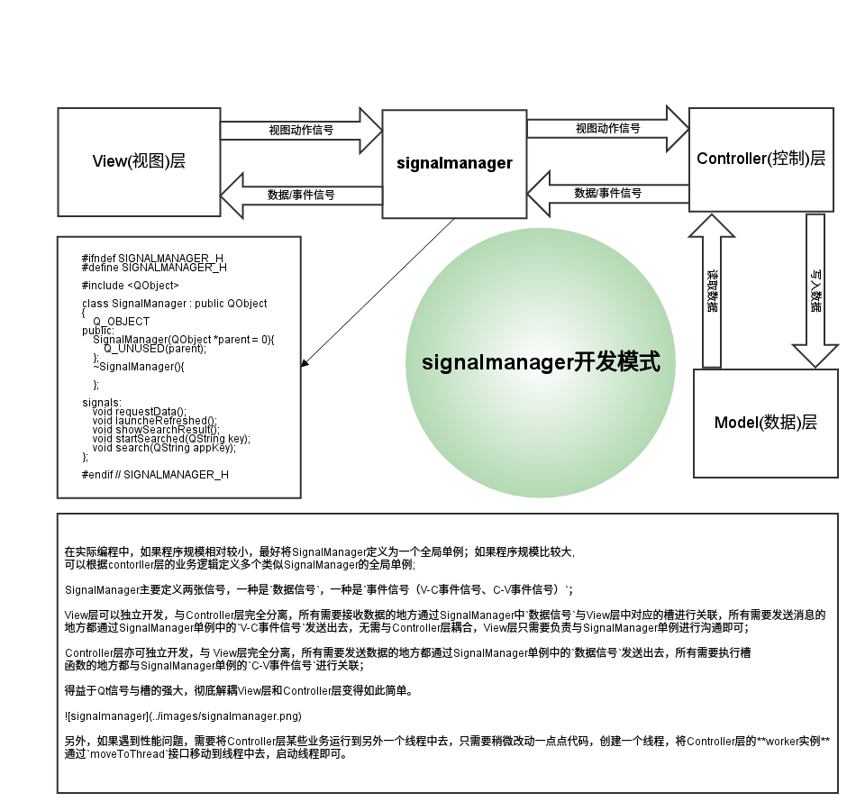

signalmanager开发模式简介
=========================

#####1. 什么是MVC设计模式

经典的mvc模式，Model(模型)、View(视图)、Controller(控制)，这种开发模式常常应用在桌面客户端程序当中

+  最上面的一层，是直接面向最终用户的"视图层"（View）。它是提供给用户的操作界面，是程序的外壳。
+  中间的一层，就是"控制层"（Controller），它负责根据用户从"视图层"输入的指令，选取"数据层"中的数据，然后对其进行相应的操作，产生最终结果。
+  最底下的一层，是核心的"数据层"（Model），也就是程序需要操作的数据或信息。

这三层是紧密联系在一起的，但又是互相独立的，每一层内部的变化不影响其他层。每一层都对外提供接口（Interface），供上面一层调用。这样一来，软件就可以实现模块化，修改外观或者变更数据都不用修改其他层，大大方便了维护和升级。

难点就是View层和Controller层分离不彻底，耦合严重，出现接口调用混乱，逻辑混乱。

那么如何才能彻底的分离View层和Controller层，模块独立开发，互不干扰？

#####2. 什么是所谓的signalmanager模式

这个是模式是我在qt开发中经常使用的一种模式，主要用于解耦MVC模式中View层与Controller层。在Qt的程序中，View层一般在主线程MainThread中, Controller层可以出现在主线程，也可出现在其他线程中，这个时候view和contoller之间的通信可以使用一个signalmanager的全局实例来进行桥接， SignalManager类中只定义signal

        #ifndef SIGNALMANAGER_H
        #define SIGNALMANAGER_H
        
        #include <QObject>
    
        class SignalManager : public QObject
        {
            Q_OBJECT
        public:
            SignalManager(QObject *parent = 0){
                Q_UNUSED(parent);
            };
            ~SignalManager(){
        
            };
        
        signals:
            void requestData();
            void launcheRefreshed();
            void showSearchResult();
            void startSearched(QString key);
            void search(QString appKey);
        };
        
        #endif // SIGNALMANAGER_H

在实际编程中，如果程序规模相对较小，最好将SignalManager定义为一个全局单例；如果程序规模比较大, 可以根据contorller层的业务逻辑定义多个类似SignalManager的全局单例; 

SignalManager主要定义两张信号，一种是`数据信号`，一种是`动作信号`；

View层可以独立开发，与Controller层完全分离，所有需要接收数据的地方通过SignalManager中`数据信号`与View层中对应的槽进行关联，所有需要发送消息的地方都通过SignalManager单例中的`动作信号`发送出去，无需与Controller层耦合，View层只需要负责与SignalManager单例进行沟通即可；

Controller层亦可独立开发，与 View层完全分离，所有需要发送数据的地方都通过SignalManager单例中的`数据信号`发送出去，所有需要执行槽
函数的地方都与SignalManager单例的`动作信号`进行关联；

得益于Qt信号与槽的强大，彻底解耦View层和Controller层变得如此简单。

另外，如果遇到性能问题，需要将Controller层某些业务运行到另外一个线程中去，只需要稍微改动一点点代码，创建一个线程，将Controller层的**worker实例**通过`moveToThread`接口移动到线程中去，启动线程即可。

